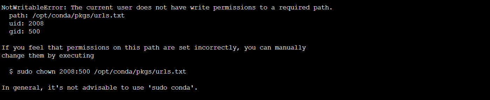

# Using Conda in Jojie

Conda is a powerful environment isolation tool that allows us to ensure that all the packages required by our codes are installed and prevent any dependency issues. This allows us to replicate and reproduce other works as well as prevent code breaking issues due to dependencies.

However, we might encounter issues since we don't have admin privileges in `jojie` (See Figure below):



This error happens since `conda` is telling us that we don't have the required permissions to write on the *package directory*. This package directory is important since this is where conda would place all the packages that we install for the environment.

To reconfigure `conda` such that `conda` will install packages on a directory that we have write permissions, perform the following steps:

1. Create a conda pkgs directory on your home directory

```
mkdir ~/.conda/pkgs -p
```

2. Create or edit `~/.condarc` and add the following lines:

```
channels:
  - conda-forge
  - defaults
pkgs_dirs:
  - ~/.conda/pkgs/
channel_priority: strict
```

This tells conda what channels to use and more importantly where to store packages. This ensures that we have write directory privileges on the packages directory of `conda`.

After this, you should be able to use `conda` to create virtual environments in your machine. Congratulations! 🎉

You may now proceed to create the environment for this repository as stated in [README.md](./README.md)
